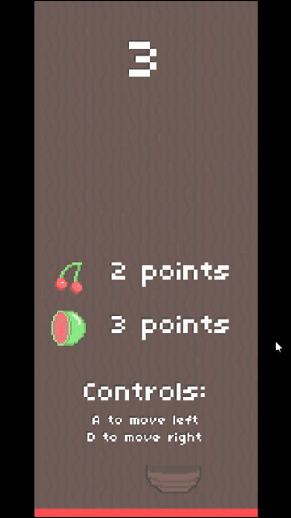

Welcome to Fruit Catcher, a simple and entertaining game where you control a basket to catch falling fruits before they reach the ground. The game features a lifebar that gradually depletes over time, and catching fruits not only earns you points but also refills the lifebar to keep the game going.


## Table of Contents

- [Game Overview](#game-overview)
- [Features](#features)
- [Controls](#controls)
- [Scoring](#scoring)
- [Lifebar Mechanics](#lifebar-mechanics)
- [How to Play](#how-to-play)
- [Installation](#installation)
- [Contributing](#contributing)
- [License](#license)

## Game Overview

Fruit Catcher is a fun and casual game developed using Love2D in Lua. The goal is to catch as many fruits as possible while managing the lifebar to prevent it from running out.



## Features

- Intuitive controls for basket movement.
- Various types of fruits with different point values.
- Lifebar system that adds strategic depth to gameplay.
- Simple and engaging graphics.

## Controls

- Use the left and right arrow keys to move the basket.


## Scoring

- Different fruits have different point values.
- Points are awarded for each successfully caught fruit.

## Lifebar Mechanics

- The lifebar depletes over time.
- Catching a fruit refills the lifebar.
- Missing a fruit reduces the lifebar.


## How to Play

1. Clone or download the repository.
2. Ensure you have Love2D installed on your system.
3. Run the game by executing the command: `love path/to/fruit-catcher`.

**Controls:**
- Use the left and right arrow keys to move the basket.

## Installation

Ensure you have Love2D installed on your machine. You can download it from [Love2D website](https://love2d.org/).

Clone the repository:

```bash
git clone https://github.com/your-username/fruit-catcher.git
```

Run the game:

```bash
love path/to/fruit-catcher
```

## Contributing

If you want to contribute to the project, feel free to fork the repository and submit pull requests. Bug reports and feature requests are also welcome!

## License

This project is licensed under the [MIT License](LICENSE).
